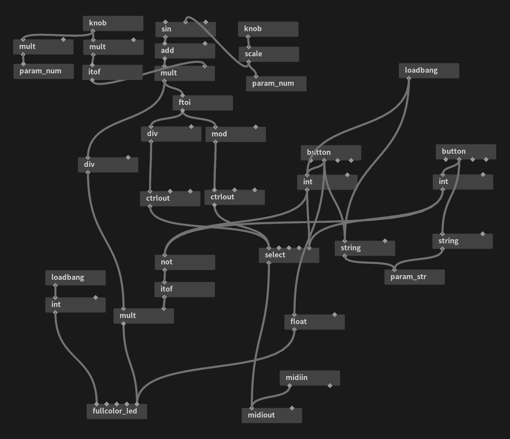

mod_lfo
---

## Description

A [midiglue](https://sigboost.audio/midiglue/) patch that drives MIDI modulation wheel messages with an LFO.

## Control

* Knob L: LFO Rate 0.10 - 2.00 Hz
* Knob R: LFO Depth 0 - 100 %
* Button A: LFO ON
* Button B: LFO OFF

## License
mod_lfo program is licensed under MIT License.  
Copyright 2022, aike (@aike1000)  
